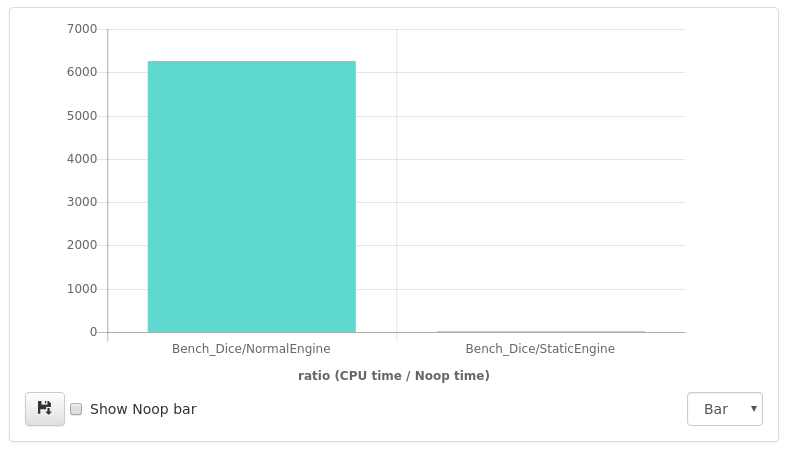
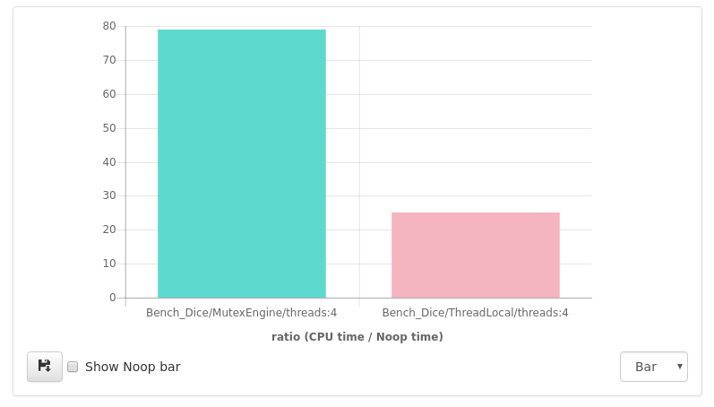

# Mało znany kuzyn statica - thread\_local
C++11 wprowadził wiele funkcjonalności, bez których nie wyobrażamy sobie pisania nowoczesnego kodu. Należą do nich na przykład move semantics, lambda czy smart pointery. Są też ficzery, z których korzysta się raczej rzadko, ale warto je znać i wiedzieć co potrafią. 
Jednym z takich dodatków jest słowo kluczowe **thread\_local**.

# Problem
Chcemy napisać funkcję, która będzie odpowiedzialna za generację liczb pseudolosowych z danego zakresu.
Najprostsza implementacja może wyglądać następująco:
```cpp
int DiceInt(int min, int max) {
  std::mt19937 engine;
  std::uniform_int_distribution<std::mt19937::result_type> dist(min,max);
  return dist(engine);
}
```
Załóżmy, że funkcja ta jest wąskim gardłem naszej aplikacji. Pierwszą rzeczą, którą można zoptymalizować, jest tworzenie silnika. 
Tworząc go za każdym razem, na pewno tracimy sporo cennych cykli procesora. Zakładając, że funkcja jest wywoływana w wielu miejscach
sporej aplikacji, przekazywanie wcześniej utworzonego silnika jako referencji byłoby zbyt czasochołonne. Spróbujmy więc zadeklarować
zmienną `engine` jako static: 
```cpp
int DiceInt(int min, int max) {
  static std::mt19937 engine;
  std::uniform_int_distribution<std::mt19937::result_type> dist(min,max);
  return dist(engine);
}
```
Warto teraz dokonać porównania i sprawdzić, jak dużo szybsza jest druga wersja. 
Posłużymy się microbenchmarkiem, w przykładzie wykorzystamy google benchmark. 
Wynik okazał się zaskakujący: 


Tworzenie nowego silnika za każdym razem jest ponad 6000 razy wolniejsze\*! [Sprawdźcie sami!](http://quick-bench.com/WZI08aApkekn67VYYf5Ie5Nl0Wo)

A co jeśli nasza aplikacja działa w świecie wielowątkowym? Zmienna statyczna jest 
w takim wypadku współdzielona pomiędzy wszystkimi wątkami, konieczny więc
jest mechanizm synchronizacyjny. Chyba, że istnieje lepszy sposób... 
Zanim do niego przejdziemy, przypomnijmy sobie kilka teoretycznych
rzeczy, znajdujących się w języku C++.

## Storage duration
Storage duration definiuje nam, jaki jest "czas przechowywania" danego obiektu, to znaczy w którym momencie zostanie stworzony i zniszczony.
Stwórzmy sobie najpierw pomocniczą strukturę, która wypisze na standardowe wyjście swój moment tworzenia i niszczenia:
```cpp
#include <iostream>

struct Foo {
  Foo(int i) : i_(i) { std::cout <<  "Foo(" << i_ << ")\n"; }
  ~Foo()             { std::cout << "~Foo(" << i_ << ")\n"; }
  int i_;
};
```

Mając taką strukturę, możemy przetestować w jakiej kolejności wywoływane są konstruktory i destruktory. 

### Automatic

Dla normalnie zadeklarowanych zmiennych, kolejność tworzenia i niszczenia jest taka, jakiej byśmy oczekiwali:
```cpp
int main() {
  Foo foo1(1); 
  {
    Foo foo2(2);
  }
  return 0;
}
```

Na ekranie pojawi się :

    Foo(1)
    Foo(2)
    ~Foo(2)
    ~Foo(1)

Zgodnie z naszą intuicją, najpierw zostanie stworzona zmienna foo1, potem foo2, 
następnie natrafiamy na koniec zakresu zmiennej foo2, więc zmienna ta zostaje 
zniszczona. Na końcu, niszczy się foo1. Taki storage duration - od momentu zadeklarowania to końca zakresu - nosi nazwę `automatic storage duration`.

### Static

Kolejnym typem storage duration jest `static storage duration`.  Oznacza on, że zmienna zostanie stworzona w kolejności zadeklarowania, a usunięta na końcu 
działania programu. Posiadają go zmienne zadeklarowane jako static, zmienne globalne oraz zmienne zadeklarowane jako extern.
Poniżej ilustracja:
```cpp
Foo foo3(3);

int main() {
  Foo foo1(1); 
  {
    static Foo foo2(2);
  }
  return 0;
}
```

Po uruchomieniu, na ekranie zobaczymy:

    Foo(3)
    Foo(1)
    Foo(2)
    ~Foo(1)
    ~Foo(2)
    ~Foo(3)

Zmienne zostały stworzone w kolejności deklaracji. Jeśli chodzi o niszczenie - najpierw wywołał się destruktor foo1 (wyjście z zakresu), dalej zmienne są niszczone w kolejności odwrotnej do tworzenia, czyli wywołał się destruktor 
zmiennej foo2 a potem zmiennej foo3. 

Warto znać niuans dotyczący inicjalizacji zmiennych ze static storage duration. Rozważmy taki przykład: 
```cpp
extern int i;
int j = i;
int i = 2;

int main() {
  return j;
}
```

W powyższym przykładzie, mogłoby się wydawać że zmienna `j` zostanie zainicjalizowana wartością 0. Jednak cały program zwraca wartość 2. 
Spróbujmy napisać więc kontrprzykład, gdzie zmienna zostanie zainicjalizowana zerem: 
```cpp
int foo() {
  return 2;
}

extern int i;
int j = i;
int i = foo(); // = 2 before

int main() {
  return j;
}
```

Po tej niewielkiej zmianie, program zwraca wartość zero. Dlaczego tak się dzieje?
Zerknijmy do standardu C++, dokładniej do [tego](http://eel.is/c++draft/basic.start.static#2) paragrafu:

>All static initialization strongly happens before (...) any dynamic initialization.

`int i = 2` jest inicjalizacją statyczną, natomiast `int i = foo()` jest inicjalizacją dynamiczną. Standard gwarantuje nam więc, że najpierw wykona się przypisanie do i.
W drugim przypadku - obie inicjalizacje są dynamiczne, więc j będzie miało wartość 0 ([zero initialization](http://en.cppreference.com/w/cpp/language/zero_initialization)).

### Thread
Najmniej znanym typem storage duration, jest ten, który deklarujemy przy użyciu tytułowego słowa kluczowego **thread\_local**. 
Aby zrozumieć różnicę pomiędzy static a thread\_local, posłużmy się przykładem.
```cpp
void foo(int i) {
  static Foo foo(i);
}

int main() {
  foo(0);
  std::thread th1(foo, 1);
  std::thread th2(foo, 2);
  th1.join();
  th2.join();
}
```

Na ekranie pojawi się:

    Foo(0)
    ~Foo(0)
    
Widzimy, że zostanie stworzona dokładnie jedna instancja struktury Foo. Zamieńmy teraz zmienną ze static na thread\_local:
```cpp
void foo(int i) {
  thread_local Foo foo(i);
}

int main() {
  foo(0);
  std::thread th1(foo, 1);
  std::thread th2(foo, 2);
  th1.join();
  th2.join();
}
```

Wyjście programu może wyglądać następująco:

    Foo(0)
    Foo(1)
    ~Foo(1)
    Foo(2)
    ~Foo(2)
    ~Foo(0)

Jak widzimy, zostały stworzone dokładnie 3 instancję struktury Foo - dla wątku głównego, th1 oraz th2.

Oprócz tego, że zmienna może być thread\_local, nic nie stoi na przeszkodzie, aby zadeklarować zmienną jako static thread local:

```cpp
static thread_local Foo foo(0);
```

W tym kontekście, słowo static odnosi się do typu linkowania i oznacza, że zmienna ma linkowanie wewnętrzne (ang. internal linkage). 
Słowo static jest tutaj zbędne, gdyż taki rodzaj linkowania jest domyślny. Alternatywą jest linkowanie zewnętrzne ze słowem kluczowym extern:

```cpp
extern thread_local Foo foo; //defined in other compilation unit;
```

Linkowanie zewnętrzne (ang. external linkage) oznacza, że zmienna foo2 jest zdefiniowana w innej jednostce kompilacji.

## Naprawa początkowego kodu

Jak się pewnie domyślaliście po przeczytaniu tytułu posta, rozwiązaniem naszego problemu
będzie zadeklarowanie silnika jako zmienną typu thread\_local. Nie musimy dodawać 
kolejnych mutexów, nie musimy martwić się o synchronizację, wystarczy dodanie jednego
słowa kluczowego i mamy szybkie, bezpieczne rozwiązanie naszego problemu. 
```cpp
int DiceInt(int min, int max) {
  thread_local std::mt19937 engine;
  std::uniform_int_distribution<std::mt19937::result_type> dist(min,max);
  return dist(engine);
}
```
Żeby nie rzucać słów na wiatr, porównajmy implementację z mutexami do implementacji
ze zmienną o `thread storage duration`.


Wersja z thread\_local okazała się być prawie 80 razy szybsza!
[Tutaj](http://quick-bench.com/Iko9jFTD4dkJgqf1SIa_VAoSnGo) możecie zobaczyć kod źródłowy testów.
## Podsumowanie

Język C++ posiada bardzo wiele funkcjonalności, których na co dzień się nie używa. Jedną z nich jest thread\_local, które może być bardzo przydatne 
w aplikacjach wielowątkowych. Zamiast synchronizować zmienną statyczną, możemy użyć zmiennej thread\_local. Kod źródłowy jest prostszy i wygląda dużo
ładniej. Jest też spora szansa, że będzie szybszy niż kod obarczony zbędną synchronizacja mutexami. 

Serdeczne podziękowania dla wszystkich, którzy sprawdzili posta przed publikacją:
- Krzysztofa Rześniowieckiego
- Jakuba Piskorza
- Piotra Jelonkiewicza
- Rafała Chabowskiego

Jesteście najlepsi!

\* - korzystaliśmy z kompilatora gcc w wersji 7.3 z flagą O3, testy były robione na stronie quick-bench.com
